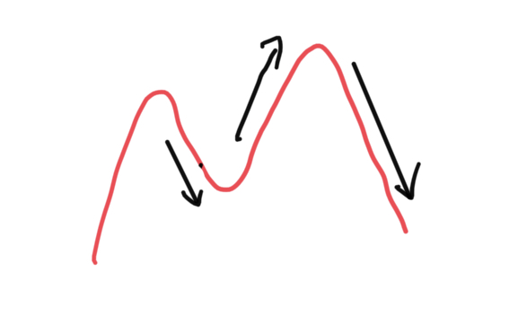
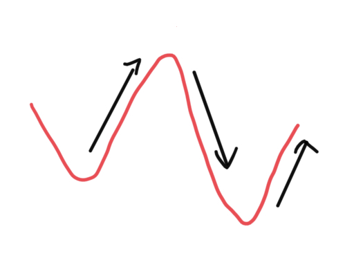

## 🌏 基于模式匹配的k线识别

### ❗️️ 运行步骤

- #### ①安装库
    - `pip install requirement.txt`

- #### ②将数据放到'data/'目录下

- #### ③将main.py文件中的data_file改成你的数据所在的地址，然后运行main.py文件

-----

### 🔔  数据需要的格式

- #### 1.使用csv文件存储数据

- #### 2.csv文件中需要包含以下数据：
    >open_time,open,close,high,low:即时间，开盘价，收盘价，最低价，最高价
  
    - ❗️注意：csv的第一列为：open_time,open,close,high,low （具体格式可参考data/test_data_1.csv)

### 🌅 输入的格式
- #### 请按要求输入你要识别的K线模式:
    - 1.请输入第一个拐点之前是上升还是下降,上升请输入1,下降请输入-1

    - 2.请输入一个列表表示拐点个数和类型,1代表由涨转跌,-1代表由跌转涨,例如:[1,-1,1,-1]表示4个拐点

    - 3.请输入一个列表表示拐点类型为1的高低差，例如:[1,2,3,4]表示有4个拐点类型为1的拐点，其中第四个拐点的点位最高，第一个拐点的点位最低

    - 4.请输入一个列表表示拐点类型为-1的高低差，格式上同，例如:[2,1,3]

### 🌅 附加条件

- #### 根据自己的需要,还可以在类中自己添加附加条件函数用于进一步的筛选

    - 1.例如:main.py的compare_add函数，用于判断最后一根K线的数据是否低于第一个拐点，低于的话返回True

    - 2.如果你想选择性的使用附加条件函数，可以自己编写该函数，然后再第73行处更改不同的flag。

    - ❗注意：程序默认使用了附加条件1和附加条件2，可以在第73行代码中选择不使用这些条件

### 🌅 案例
   - #### K线模式1： 图片在figure/模式1.jpg中 输入:
    - 1
    - [1,-1,1]
    - [1,2]
    - [1]
    - 使用了附加条件1和附加条件2

   - ####  K线模式2： 图片在figure/模式2.jpg中 输入： -1
    -[-1,1,-1]
    -[1]
    -[2,1]

### 🌅 所有文件
 - 最后得到的k线图在data/save_html中

